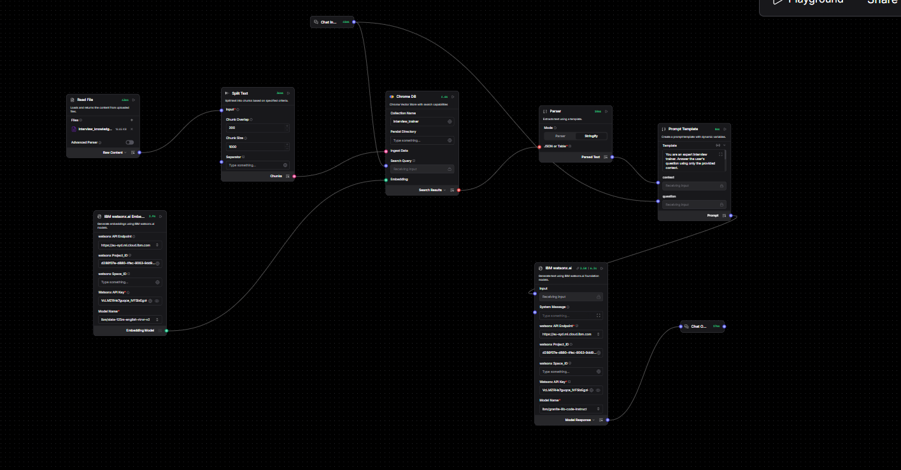
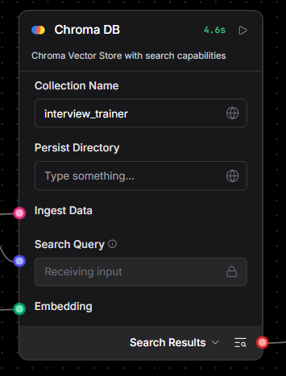

# 🎯 InterviewTrainerAgent — Agentic AI Interview Coach

<div align="center">


**Stop guessing what interviewers want. Let AI train you.**

[](https://langflow.org)
[](https://www.ibm.com/watsonx)
[](https://www.ibm.com/watsonx)
[](https://www.trychroma.com)
[]()
[](https://www.aicte-india.org)
[](LICENSE)

[🚀 Live Demo](#) · [📸 Screenshots](#-screenshots) · [🛠 Setup Guide](#-setup-guide) · [🐛 Report Bug](issues)

</div>

---

## 🤖 What is InterviewTrainerAgent?

InterviewTrainerAgent is an **autonomous, multi-agent AI system** that prepares candidates for job interviews using RAG-powered retrieval and IBM Granite's language intelligence.

Tell it your job role → It generates targeted questions → You answer → It evaluates your response and gives expert-level feedback. Like having a personal interview coach available 24/7.

> Built for **IBM SkillsBuild × AICTE University Engagement 2026** | Problem Statement No. 22

---

## ❓ Why This Exists

Every student preparing for placements faces the same problem — generic YouTube videos and static question lists that don't actually prepare them for a real interview conversation.

InterviewTrainerAgent solves this by:
- 🧠 **Understanding context** — retrieves role-specific questions using semantic search, not keyword matching
- 🎯 **Personalizing** — adjusts question difficulty based on your job role (SDE, Data Analyst, Frontend, etc.)
- 📝 **Evaluating answers** — gives structured feedback: what was good, what's missing, model answer
- 🔁 **Simulating real interviews** — follow-up questions, pressure handling, behavioral rounds

---

## 💡 What Makes This Different?

| Feature | Generic Prep Tools | InterviewTrainerAgent |
|---|---|---|
| Question Source | Static PDFs | RAG from curated knowledge base |
| Personalization | None | Role + difficulty adaptive |
| Answer Feedback | None | Detailed AI evaluation |
| Conversation | One-way | Interactive multi-turn |
| Technology | Basic | IBM Granite + Agentic AI |
| Hallucination Control | ❌ | ✅ RAG-grounded responses |

---

## ✨ Key Features

- **🤖 Agentic Architecture** — Multi-component LangFlow pipeline that autonomously routes questions, retrieves context, and generates responses
- **📚 RAG-Powered Knowledge Base** — Chroma DB stores 33+ Q&A pairs across 6 job roles; semantic search finds the most relevant context every time
- **🧬 IBM Granite LLM** — Uses `ibm/granite-3-2-8b-instruct` via watsonx.ai for grounded, accurate interview coaching
- **🔍 Semantic Embeddings** — `ibm/slate-30m-english-rtrvr` converts interview content to vectors for similarity-based retrieval
- **💬 Conversational Interface** — LangFlow Playground provides a clean chat UI — ask questions, get answers, iterate
- **🛡️ Zero Hallucination Guardrails** — Prompt template restricts model to only answer from retrieved context
- **⚡ Real-time Response** — IBM watsonx.ai delivers responses in seconds via cloud inference

---

## 🏗️ System Architecture

```
┌─────────────────────────────────────────────────────────────┐
│                    KNOWLEDGE INGESTION                       │
│                                                             │
│  interview_knowledge_base.txt                               │
│           │                                                 │
│           ▼                                                 │
│      Read File → Split Text ──────────────────────────┐    │
│                                  IBM watsonx           │    │
│                                  Embeddings ───────────┼──→ Chroma DB │
└──────────────────────────────────────────────────────────────┘
                                                         │
┌─────────────────────────────────────────────────────────────┐
│                    QUERY & RESPONSE                         │
│                                                             │
│  User Input (Job Role + Question)                           │
│       │                                                     │
│       ▼                                                     │
│  Chat Input ─────────────────────────────────┐             │
│       │                                      │             │
│       │              Chroma DB ──────────────┤             │
│       │           (Semantic Search)          │             │
│       ▼                                      ▼             │
│       └──────────────→ Prompt Template ←─────┘             │
│                              │                              │
│                              ▼                              │
│                    IBM watsonx.ai                           │
│                 (Granite-3.2-8B-Instruct)                   │
│                              │                              │
│                              ▼                              │
│                       Chat Output                           │
│                   (Feedback + Model Answer)                 │
└─────────────────────────────────────────────────────────────┘
```

---

## 🛠️ Tech Stack

### 🧠 AI & Agent Layer
| Technology | Role |
|---|---|
| LangFlow | Visual agent orchestration & pipeline builder |
| IBM Granite 3.2 8B Instruct | Core LLM for response generation |
| IBM watsonx Embeddings (slate-30m) | Text → Vector conversion for RAG |
| Chroma DB | Vector store for semantic retrieval |
| RAG Architecture | Grounds all responses in curated knowledge |

### ☁️ Cloud & Infrastructure
| Technology | Role |
|---|---|
| IBM watsonx.ai Studio | Model deployment & project management |
| IBM Cloud Lite | Free tier cloud services |
| LangFlow Playground | Chat interface for interaction |

### 📦 Dataset
| Technology | Role |
|---|---|
| Custom Q&A Dataset | 33 pairs across SDE, HR, DA, Frontend, AI/ML, System Design |
| TXT / CSV / JSON | Three formats: RAG ingestion, analysis, structured storage |

---

## 📸 Screenshots

### 🔀 LangFlow Agent Pipeline



### 💬 Live Chat Interaction


### 🗃️ Chroma DB Vector Store



---

## 📊 Dataset Coverage

```
interview_knowledge_base.txt
│
├── 🖥️  SDE / Backend          → 10 Q&A pairs  (Technical)
├── 🧑‍💼  HR / Behavioral        →  8 Q&A pairs  (All Roles)
├── 📊  Data Analyst / AI-ML   →  7 Q&A pairs  (Technical)
├── 🌐  Frontend Developer     →  4 Q&A pairs  (Technical)
├── 🏛️  System Design          →  2 Q&A pairs  (Conceptual)
└── 🤖  AI/ML Engineer         →  2 Q&A pairs  (Technical)
                                 ─────────────
                                  33 Total  →  Expanding...
```

---

## 📁 Project Structure

```
InterviewTrainerAgent/
│
├── 📂 data/
│   ├── interview_knowledge_base.txt   ← RAG ingestion (LangFlow)
│   ├── interview_qa_dataset.csv       ← Tabular format
│   └── interview_qa_dataset.json      ← Structured format
│
├── 📂 assets/
│   ├── langflow_canvas.png            ← Add your screenshot
│   ├── chat_demo.png                  ← Add demo screenshot
│   └── knowledge_base.png             ← Add KB screenshot
│
├── 📂 flow/
│   └── interview_trainer.json         ← LangFlow export file
│
└── README.md
```

---

## ⚙️ Setup Guide

### Step 1 — IBM Cloud Setup

```
1. Go to cloud.ibm.com → Create free account (no credit card)
2. Search "watsonx.ai" in catalog → Enable it
3. Create new project → Name it "InterviewTrainerAgent"
4. Go to: Project → Manage tab → General → Copy Project ID
5. Go to: IBM Cloud → Top right (your name) → API Keys → Create → Copy
```

### Step 2 — LangFlow Setup

```
1. Go to langflow.org → Sign in with GitHub
2. Click "New Flow" → Blank Canvas
3. Add these components (search in sidebar):
   - Chat Input
   - Read File
   - Split Text
   - IBM watsonx Embeddings
   - Chroma DB
   - Prompt
   - IBM watsonx.ai
   - Chat Output
```

### Step 3 — Fill IBM Credentials

In both **IBM watsonx.ai** and **IBM watsonx Embeddings** components:

```
watsonx API Endpoint  →  us-south.ml.cloud.ibm.com
watsonx Project_ID    →  <paste your project id>
Watsonx API Key       →  <paste your api key>
watsonx Space_ID      →  (leave blank)
```

Model Names:
```
IBM watsonx.ai         →  ibm/granite-3-2-8b-instruct
IBM watsonx Embeddings →  ibm/slate-30m-english-rtrvr
```

### Step 4 — Upload Knowledge Base

```
Read File component → "Select files" → Upload interview_knowledge_base.txt
Split Text → Chunk Size: 500 | Chunk Overlap: 50
```

### Step 5 — Prompt Template

Paste this inside the **Prompt** component:

```
You are an expert Interview Trainer AI. Use ONLY the context below to answer.
Give structured, detailed advice with examples where possible.

Context:
{context}

User Question:
{question}

Answer:
```

### Step 6 — Connect & Run

```
1. Draw all connections in LangFlow canvas
2. Click "Playground" button (top right)
3. Start chatting!
```

---

## 💬 Example Interactions

```
User  →  "I'm preparing for SDE role. Ask me a technical question."
Agent →  "What is the time complexity of binary search and why?
          Take your time to answer."

User  →  "It's O(log n) because we divide the array in half each time."
Agent →  "Good answer! You correctly identified O(log n).
          To make it stronger, mention: 1) It requires sorted array,
          2) For n=1000, only 10 comparisons needed.
          Model answer: Binary search is O(log n) because..."
```

```
User  →  "How do I answer 'Tell me about yourself'?"
Agent →  "Use the Present-Past-Future structure:
          Present: Current role/education + key skill
          Past: Relevant experience/project
          Future: Why THIS company excites you
          Keep it 90 seconds. End with enthusiasm..."
```

---

## 🚀 What's Next

- [ ] Resume PDF upload → auto-detect role and generate targeted questions
- [ ] Score system (1–10) with detailed rubric per answer
- [ ] Expand dataset to 200+ Q&A pairs across 15+ roles
- [ ] Streamlit web app deployment
- [ ] Hindi language support for regional users
- [ ] Session history — track improvement over multiple sessions

---

## 🏫 Internship Details

| Field | Detail |
|---|---|
| Program | IBM SkillsBuild × AICTE University Engagement 2026 |
| Organizing Body | Edunet Foundation |
| Problem Statement | No. 22 — Interview Trainer Agent (RAG Based) |
| Mandatory Tech | IBM Cloud Lite / IBM Granite |
| Architecture | Agentic AI + RAG |

---

## 📄 License

This project is licensed under the MIT License — see [LICENSE](LICENSE) for details.

---

<div align="center">

Built with ❤️ using **IBM Granite** + **LangFlow** + **watsonx.ai**

⭐ Star this repo if it helped you!

</div>S
